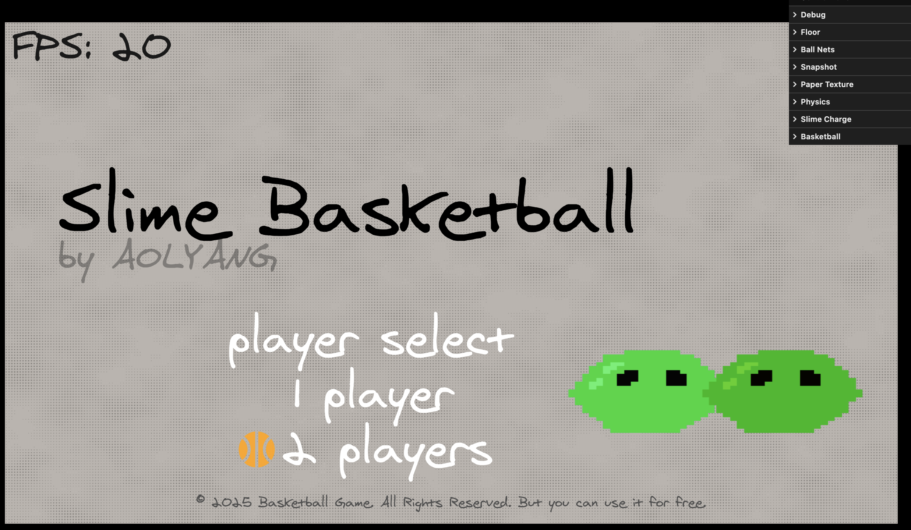
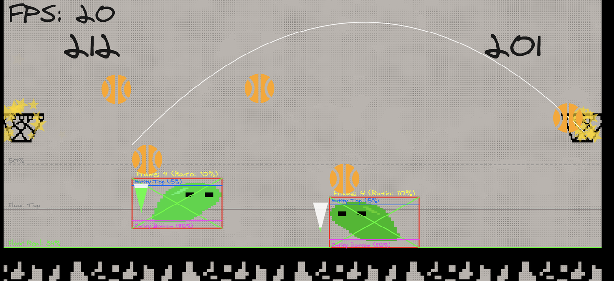

# 史莱姆篮球小游戏

使用到：p5，matter-js， lil-gui，TypeScript， 帧动画。vite dev

trae在这次编程的代码生成率在80%以上，Cursor起到了少部分纠错、起头的作用，但只要trae能正确开始生成，我就不会使用cursor。在后面的编程日志中有注明哪些地方切到了cursor中。
先说结论：
cursor目前肯定还是更好用一点，cursor的编辑器能集成vscode原有插件，请求也不会排队，生成的质量（一次可用率80%左右，二次成功率90+%）也较好。但这个生成质量正在以肉眼可见的速度被trae赶上。  

trae的生成质量在3月15日我更新之后（可能时累积的），明显感觉同样是trae，质量终于是上来了，一次成功率不好统计，但应该是很接近cursor了，我很少在改动时再切过去。  

trae的对话时性能开销也有所优化，之前（3月15日之前）我特意开了性能监视器（19款 interl i7 macbook Pro)，cursor和trae的agent（render process）都能飙到cpu 110%左右，更新后使用下来似乎没那么卡了。  

再说AI辅助编程的感受：  

AI非常适合快速铺代码，AI确实帮助我在短时间内实现了一个demo游戏（虽然没啥可玩性，也不算成品）。我几乎全程使用白话，没有列出清晰的tasks（因为我也不专业），甚至很多时候用词、语义都是错的，但AI就是做出来了，和我预想的很接近。
但行业领域内还是需要经验丰富的开发者带领AI，AI充当的应该是个高效率辅助者的角色，所以低代码已死？  

我之前也体验过 Figma-contxt-MCP这类UI直接出代码的方案，配合AI实现业务逻辑，效果简直不要太好，如果使用figma的设计严格使用figma的组件、variants物料和主题系统（比如Mui的社区设计稿）生成的结果99%的还原和可用，甚至带业务代码。  

但在Graphics 2D/3D领域内，AI根据结果自我验证回测的撇套实在是太少，在我这次的生成结果中，只能算得上有结果，但难以维护  

选择用p5硬写一个游戏对我这个门外汉来说，还是太艰难，在到一定复杂度之后，效率、时间、结果都在随着这个复杂度下降，遂到此终止，开发中的可能比较重要的节点（功能）的对话记录如后文  

完整一点的记录 >>> [飞书链接](https://g98etdwz8h.feishu.cn/docx/A672d7vf6oeAIfx926scZsSSnWg)